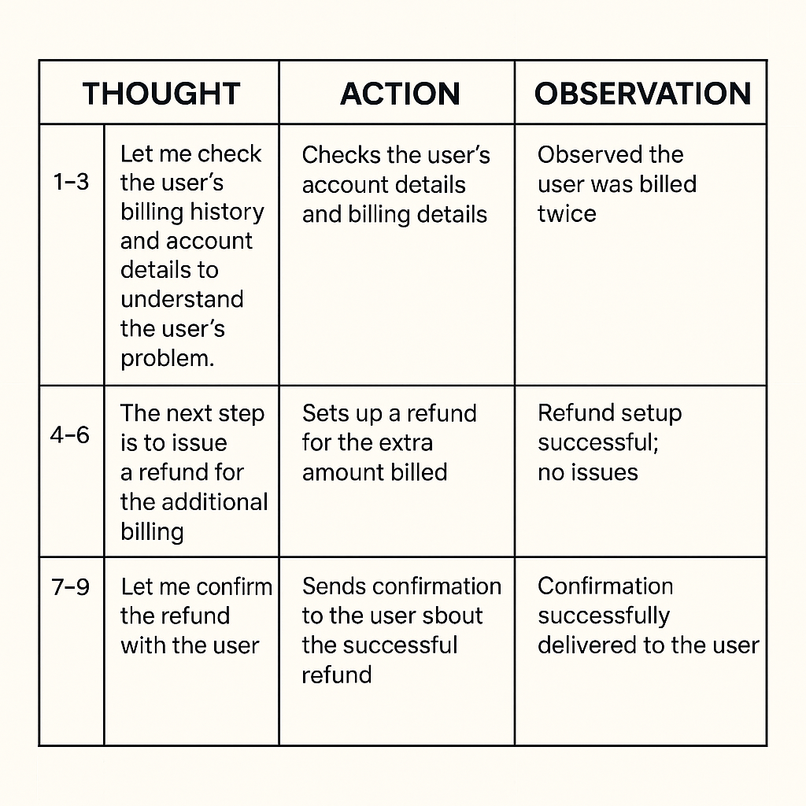

# How AI Agent Works
AI agent is a system that uses a Large Language Model to plan, reason and take steps to interact with its environment using tools suggested from the model’s reasoning to solve a particular task. 

###### Basic Structure of an AI Agent

* Large Language Model(LLM): LLM is the brain of an AI agent. It takes a user’s prompt, plans and reasons through the request and breaks the problem into steps that determine which tools it should use to complete the task.

* Tool: is the framework that the agent uses to perform an action based on the plan and reasoning from the Large Language Model.  If you ask an LLM to book a table for you at a restaurant, possible tools that will be used include calendar to check your availability and a web search tool to access the restaurant website and make a reservation for you. 

#### Ilustrated Decision Making of a Booking AI Agent

*AI agents can access different tools depending on the task. A tool might be a data store, such as a database. For example, a customer-support agent could access a customer’s account details and purchase history and decide when to retrieve that information to help resolve an issue.*

### Working Mechanism of an AI Agent (Thought Act Observation)

The decision making process of an AI Agent follows an approach known as Thought Act Observation.

* Thought: Large Language Model reasons and plans on what actions or steps to be taken based on the prompt such as the tools to be used.

* Act: The agent performs an action(uses a tool) based on the reasoning of the Large Language Model.

* Observation: The LLM observes the result of the action taken.

The Thought Act Observation is a cycle of the LLM thinking of what do deciding the action/tool to be used by agent, the agent using the tool and taking the necessary action, LLM observes the output of the action if it is success or failure, think again and the agent takes the next action. Thought Act Observation is a repeated cycle that keeps going till a problem is solved. It is analogous to a human thinking process when we are given a problem, we first think about how to solve the problem, take action on our thoughts we observe and observe the results of the action if it solves the problem, making necessary adjustments based on the results of our actions. The steps taken during Thought Act Observation cycle depends on the complexity of the work at hand, the more complex, the more the steps. 

##### Thought Act Observation Cycle of a customer support agent that is built to solve a user’s billing issue.

*Problem: A customer opened a ticket saying, ‘I was billed twice for my subscription.*

There are 9 steps taken by the Billing agent to resolve the user’s billing issues. The breakdown of the details of the tabular diagram below;

* Step 1–3: Thought: Let me check the user’s billing history and account details to understand the problem.Action: Checks the user’s account details and billing details.Observation: Observed the user was billed twice.

* Step 4–6: Thought: The next step is to issue a refund for the additional billing.Action: Sets up a refund for the extra amount billed.Observation: Refund setup successful; no issues.

* Step 7–9: Thought: Let me confirm the refund with the user.Action: Sends confirmation to the user about the successful refund.Observation: Confirmation successfully delivered to the user.

