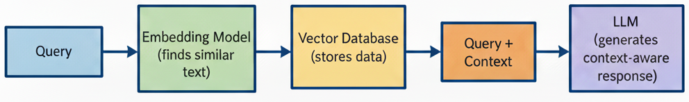
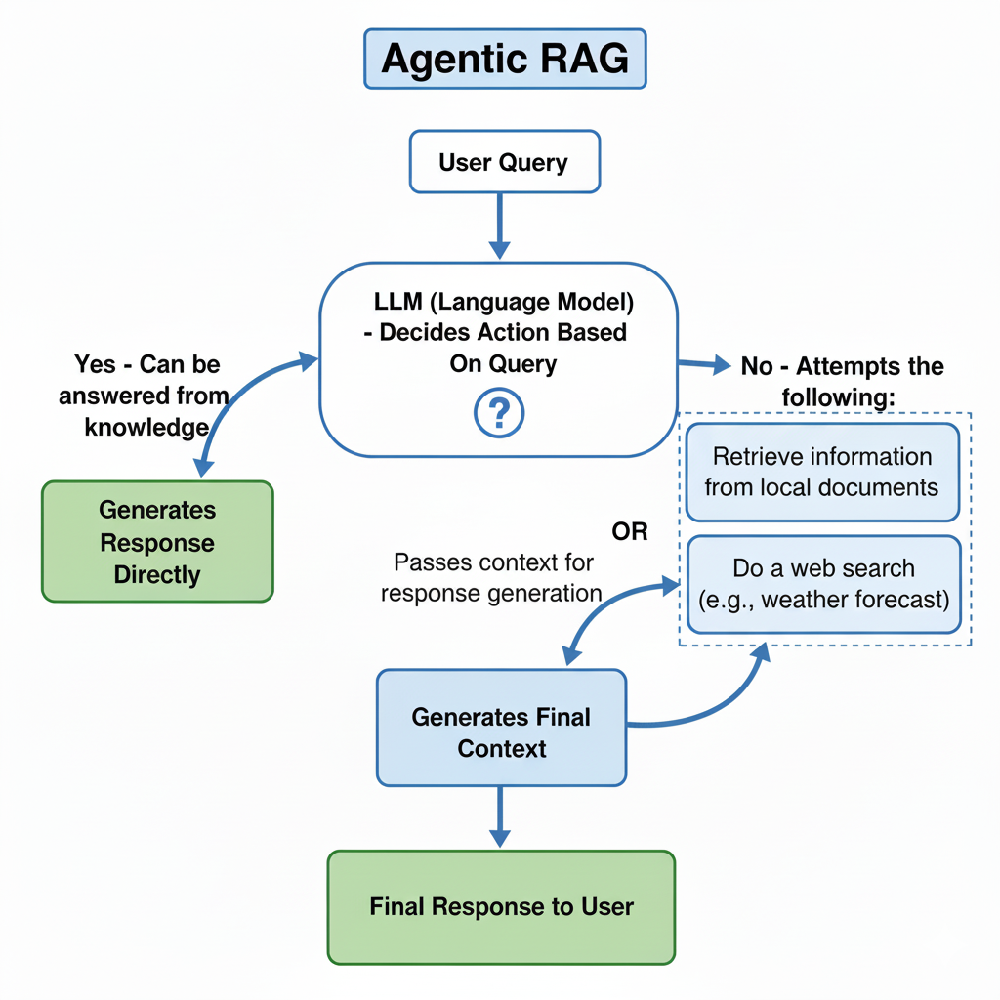
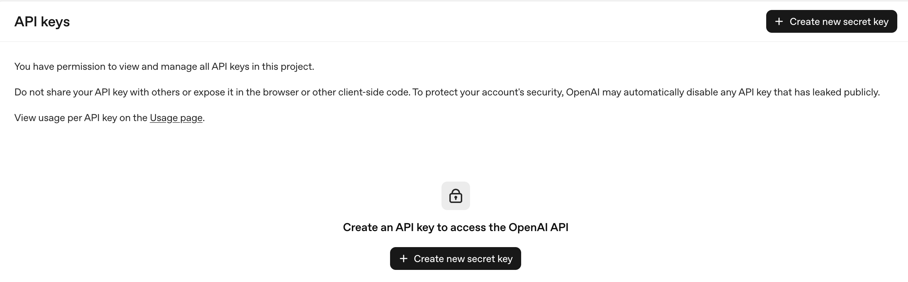
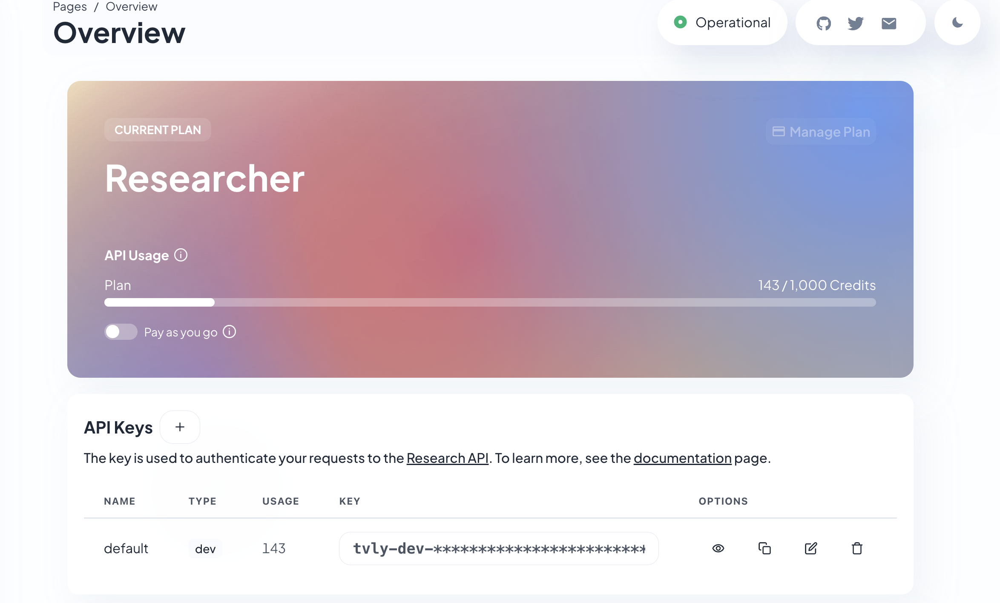
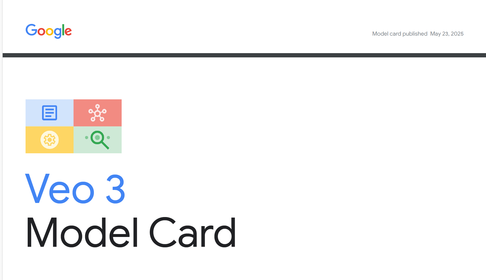

# How to build an Agentic RAG Using Function Calling

AI agents are used to solve many complex problems, such as writing code and building projects. An AI agent works by connecting a Large Language Model (LLM) to external tools enabling it to interact with its environment and complete tasks. Retrieval-Augmented Generation (RAG) is a technique that retrieves relevant data for an LLM to generate more accurate responses. The principles of AI agents are used to power RAG systems to make them more efficient and autonomous. 

### Vanilla RAG vs Agentic RAG

A basic Retrieval-Augmented Generation (RAG) structure includes a Large Language Model (LLM) for text generation, an embedding model for finding similar texts and a vector database for efficient data storage and retrieval. For every prompt a user submits, the embedding model processes the prompt and searches the vector database for similar context. The retrieved context is then added to the prompt and passed to the LLM to generate a more accurate response.

### Basic Structure of A Vanilla RAG


The Vanilla RAG system follows a static workflow and is not very efficient because the Large Language Model cannot decide when to retrieve information and when not to. It is also limited in retrieving data from multiple sources. 

### Basic Structure of an Agentic RAG


Agentic Retrieval-Augmented Generation (RAG) extends the capabilities of vanilla RAG by adding automation that allows the Large Language Model to decide when to retrieve information and when not to. A sample Agentic RAG system may include multiple data sources for providing context, such as PDFs or web search. When a query is asked, the system decides whether it can answer directly from its own knowledge or whether it needs to retrieve information. 

For example, if we provide an Agentic RAG with a PDF file of financial records, and the user asks a question about those records, it will retrieve the information from the PDF. But if the query is something like *“What is the weather like today?”*, the system will decide that a web search is the best option. On the other hand, if the query is *“Write a tutorial on Python”* it will generate the response directly from its knowledge base without calling any retrieval function. 

### Building an Agentic RAG with Function Calling

Function calling is a technique used to connect a Large Language Model (LLM) to an external tool such as an API or a database. It is in creating AI agents to enable LLMs to interact with tools. Function calling in agents typically works as follows:

The external tool is usually a code function defined to call a specific API, such as a weather API to fetch the latest forecast.

It can also be used in a RAG-based agent, where a function is defined to extract information from unstructured data like PDFs.

Custom instructions, usually in the form of a JSON schema tell the LLM how to act when it encounters a particular task and which tool (function) it should call to solve it.

In this course, I will build an Agentic RAG system using function calling. The Agentic RAG will have access to two data sources: a function for retrieving information from a local document and a function for accessing the internet to retrieve up-to-date information.

#### Prerequisite
[Create an OpenAI Account](https://auth.openai.com/create-account) if you don’t have one and [Generate an API Key](https://platform.openai.com/api-keys) .


###### Set up and Activate Environment 

```
python3 -m venv env
source env/bin/activate
```

##### Export OpenAI API Key

```
export OPENAI_API_KEY=Your Openai API Key
```

##### Setup Tavily for Web Search 

Tavily is a specialized web-search tool for AI agents. Create an account on Tavily.com, once your profile is set up, an API key will be generated that you can copy into your environment. New account receives 1000 free credits that can be used for up to 1000 web searches. 

```
export TAVILY_API_KEY=Your Tavily API Key
```

#### Install Packages

```
openai
tavily-python
qdrant-client
spacy
langchain
langchain-community
pypdf
```

Paste the packages above in a requirements.txt file and install using:

```
pip3 install -r requirements.txt
```

### Process Local Document for RAG

The local document to be used will be Veo 3 Model Card Paper. Veo 3 is a state of the art video generation model from Google.  The goal of the agentic RAG project is for us to have an agent that can answer questions based on the local document whenever it is asked question about Veo 3 video Model and do a web search whenever a query requires up to date information. 

##### Load and Process PDF File


[Download Veo 3 Model Card paper](https://storage.googleapis.com/deepmind-media/Model-Cards/Veo-3-Model-Card.pdf).  It is a 4-page PDF paper containing information on how Veo 3 was trained, the data used, its architecture, evaluation methods, and its ethics and safety.

``` python
from langchain_community.document_loaders import PyPDFLoader

def load_pdf(pdf_path: str, page1_on_second: bool = True) -> str:
    loader = PyPDFLoader(pdf_path)
    pages = loader.load()
    parts = []
    
    for p in pages:
        idx0 = p.metadata.get("page", 0)  
        label = idx0 if page1_on_second else (idx0 + 1)
        parts.append(f"[PAGE {label}]\n{p.page_content.strip()}")

    return "\n\n".join(parts).strip()
```

The *load_pdf* function is used to load and extract content from a PDF file and return it.

#### Data Chunking and Overlapping

A large language model (LLM) reads a limited number of tokens per inference known as context window. Different LLMs have different context windows, from just a few thousand tokens to over a million. In practice unstructured data like PDFs can be much larger than a single context window. Chunking addresses this by splitting a document into smaller, manageable pieces known as chunks that fit within the context window, making it suitable for efficient information retrieval.  The challenge with chunking is boundary loss, where important details may be lost at the edges of adjacent chunks. Overlapping is a technique used together with chunking to add a small slice of text at the end of one chunk at the beginning of the next chunk to preserve continuity and helps the model follow transitions and dependencies. It improves both accuracy and the quality of responses in RAG.

``` python
import spacy
from typing import List
from langchain.text_splitter import TokenTextSplitter
import re

def chunk_data(
    text: str,
    chunk_size: int = 1500,
    chunk_overlap: int = 225
) -> List[str]:
    nlp = spacy.blank("en")
    if "sentencizer" not in nlp.pipe_names:
        nlp.add_pipe("sentencizer")

    splitter = TokenTextSplitter(
        chunk_size=chunk_size,
        chunk_overlap=chunk_overlap,
        encoding_name="cl100k_base",
    )

    chunks: List[str] = []

    parts = re.split(r"\n?\[PAGE\s+(\d+)\]\n", text)
    it = iter(parts[1:])
    for page_label, page_text in zip(it, it):
        sentences = [s.text.strip() for s in nlp(page_text).sents if s.text.strip()]
        page_chunks = splitter.split_text("\n".join(sentences))
        for chunk in page_chunks:
            chunks.append(f"[Page {page_label}] {chunk}")

    return chunks
```
The *chunk_data* function performs the following roles:

* Uses spaCy to split text into sentences.

* Cleans the text.

* Uses TokenTextSplitter to split the text into chunks of 1,500 tokens with an overlap of 225 tokens.

* cl100k_base is the tokenizer used to split the text into tokens.

##### Note: The chosen chunk size and overlap are fine for small PDFs (the Veo 3 model card paper is only 4 pages). These values can be adjusted for larger documents that may contain hundreds or thousands of pages.

### Setup Qdrant for Vector Database
Qdrant is an open-source vector database used for storing and retrieving vector embeddings. I will use Qdrant as the vector store for the RAG system. 

``` python
from qdrant_client.models import VectorParams, Distance
from qdrant_client.models import PointStruct
from qdrant_client import QdrantClient

qdrant_client = QdrantClient(":memory:")
collection_name = "vector_store"
qdrant_client.create_collection(
    collection_name = collection_name,
    vectors_config=VectorParams(
        size=1536,
        distance=Distance.COSINE,
),)
```
The Qdrant client was initialized and a collection was created to store vector embeddings with the following parameters:

* size: the dimension of the vector embeddings.

* distance: the similarity search method used to find texts with similar meanings based on their vector embeddings. It is set to use cosine similarity.

#### Helper Code for uploading document to Vector Database
The next step is to define the code that uploads the processed PDF file to the Qdrant vector database. I will use an embedding model from the OpenAI API to generate vector embeddings for the text, which will then be stored in the vector database.

``` python
import os
from openai import OpenAI

openai_client = OpenAI(api_key=os.getenv("OPENAI_API_KEY"))

def create_upload_embeddings(chunks):
    model_name = "text-embedding-3-small"
    response = openai_client.embeddings.create(input=chunks, model=model_name)

    embeddings = [record.embedding for record in response.data]

    points = [
        PointStruct(
            id=idx,
            vector=vec,
            payload={"text": text},
        )
        for idx, (vec, text) in enumerate(zip(embeddings, chunks))
    ]

    qdrant_client.upsert(
        collection_name=collection_name,
        wait=True,
        points=points,
    )
```

##### Code Walkthrough

* Initialized the OpenAI API client using the API key.

* Uses text-embedding-3-small as the embedding model from OpenAI API to find texts with similar meanings.

* The embedding model generates vector embeddings for the text chunks.

* The text, along with its corresponding vector embeddings is inserted into the collection defined in the Qdrant vector database.

#### Upload Local Document(PDF) to Vector Store
``` python
text = load_pdf("Veo-3-Model-Card.pdf")
chunks = chunk_data(text)

create_upload_embeddings(chunks)
```

The PDF *“Veo-3-Model-Card.pdf”* is chunked using the chunk_data function and uploaded to the vector store with the create_upload_embeddings function.

#### Setup Tools(Functions) for Function Calling for the Agentic RAG

I will define two functions that provide different data sources for the RAG system: one for retrieving information from the PDF file and another for searching the web.

#### Function for Local Document(PDF)
``` python
def retrieve_document(query: str, top_k: int = 5) -> str:
    model_name = "text-embedding-3-small"
    query_embedding = openai_client.embeddings.create(
        input=[query], model=model_name
    ).data[0].embedding

    results = qdrant_client.query_points(collection_name, query_embedding, limit=top_k, with_payload=True)
    retrieved_texts = [output.payload["text"] for output in results.points if output.payload and "text" in output.payload]
    context = "\n\n---\n\n".join(retrieved_texts) if retrieved_texts else "no relevant context found"

    output = f"""Based on the following context:
        <context>
        {context}
        </context>

        Provide a relevant response to:

        <query>
        {query}
        </query>
        """.strip()
    
    return output
```

The *retrieve_document* function handles the retrieval of information from the PDF file. 

* A query is accepted.

* The embedding model generates a vector embedding for the query.

* Qdrant’s built-in search is used to find the most similar texts from the stored vector embeddings retrieving the top 5 matches.

* The retrieved context are combined with the query and returned.

#### Function for Web Search 

A web search function is implemented using Tavily serving as the tool to use in the agentic RAG when up-to-date information is required. 

``` python
from tavily import TavilyClient

tavily = TavilyClient(api_key=os.getenv("TAVILY_API_KEY"))

def web_search(query: str, num_results: int = 10):
    try:
        result = tavily.search(
            query=query,
            search_depth="basic",
            max_results=num_results,
            include_answer=False,       
            include_raw_content=False,
            include_images=False
        )

        results = result.get("results", [])

        return {
            "query": query,
            "results": results, 
            "sources": [
                {"title": r.get("title", ""), "url": r.get("url", "")}
                for r in results
            ]
        }

    except Exception as e:
        return {
            "error": f"Search error: {e}",
            "query": query,
            "results": [],
            "sources": [],
        }
```
Tavily is initialized with its API key. In the web_search function, the following steps are performed:

* Tavily search function is called to search the internet and retrieve the top 10 results.

* The search results and their corresponding sources are returned.

This returned output will serve as relevant context for the web search agent: which we will define later in this article, to fetch up-to-date information for queries (prompts) that require real-time data such as weather forecasts. 

#### Create Tool Schema

The tool schema defines custom instructions for an AI model on when it should call a tool. In this case, there are two tools: one for retrieving information from a document and another for performing a web search. The schema also specifies the conditions and actions to be taken when the model calls a tool.A json tool schema is defined below based on the [OpenAI tool schema structure](https://platform.openai.com/docs/guides/structured-outputs?context=with_parse#supported-schemas).

``` json
tool_schemas = [
   {
        "type": "function",
        "name": "retrieve_document",
        "description": """
        "Search the internal PDF file containing Veo Model Card.
        Use this tool when the user requests information about Veo 3
        that only appear in this document and
        for every answer you give include page-number citations in the form [page. X]. 
        """,
        "strict": True,
        "parameters": {
            "type": "object",
            "properties": {
                "query": {
                    "type": "string",
                    "description": "Query to be searched in the PDF corpus.",
                },
            },
            "required": ["query"],
            "additionalProperties": False
        },
    },
    
   {
        "type": "function",
        "name": "web_search",
        "description": """Execute a web search to fetch up to date information. Synthesize a concise, 
        self-contained answer from the content of the results of the visited pages.
        Fetch pages, extract text, and provide the best available result while citing 1-3 sources (title + URL). "
        If sources conflict, surface the uncertainty and prefer the most recent evidence.
        """,
        "strict": True,
        "parameters": {
            "type": "object",
            "properties": {
                "query": {
                    "type": "string",
                    "description": "Query to be searched on the web.",
                },
            },
            "required": ["query"],
            "additionalProperties": False
        },
    },
]
```

Two schemas are defined: one for the *retrieve_document* function and the other for the *web_search* function. Each tool schema has the same properties:

#### Tool schema’s Properties

* type: Specifies that the type of tool is a function.

* name: The function name to be used for the tool call: the first tool schema has the function name retrieve_document, and the second tool schema has the function name web_search.

* description: Describes what the AI model should do when calling the web search tool.  The first tool schema instructs the model to use retrieve_document when it receives a query about Veo 3 model. The second tool schema instructs the model to search the internet using the web_search function to fetch up-to-date information and extract relevant details to generate the best response.

* strict: It is set to true, this property instructs the LLM to strictly follow the tool schema’s instructions.

* parameters: Defines the parameters that will be passed into the functions in the tool schemas. In first tool schema query represents the questions on Veo 3 model to be searched in the pdf file, while in the second tool schema query represents the search term to look up on the internet. 

* required: Instructs the LLM that query is a mandatory parameter for both tools. 

* additionalProperties: it is set to false, meaning that the tool’s arguments object cannot include any parameters other than those defined under parameters.properties.

#### Create Agentic RAG Using GPT-5 and Function Calling

Now we build the Agentic RAG. It will retrieve information from the PDF file for queries about the Veo 3 model and perform a web search when up-to-date information is needed. I will use GPT-5-mini, a fast and accurate model from OpenAI along with function calling to invoke the tool schemas and the web_search and retrieve_document functions already defined.

``` python
from datetime import datetime, timezone
import json

# tracker for the last model’s response id to maintain conversation’s state 
prev_response_id = None

# a list for storing tool’s results from the function call 
tool_results = []

while True:
    # if the tool results is empty prompt message 
    if len(tool_results) == 0:
        user_message = input("User: ")

        """ commands for exiting chat """
        if isinstance(user_message, str) and user_message.strip().lower() in {"exit", "q"}:
            print("Exiting chat. Goodbye!")
            break

    else:
        # set the user’s messages to the tool results to be sent to the model 
        user_message = tool_results.copy()
    
        # clear the tool results for the next call 
        tool_results = []

    # obtain current’s date to be passed into the model as an instruction to assist in decision making
    today_date = datetime.now(timezone.utc).date().isoformat()     

    response = openai_client.responses.create(
        model = "gpt-5-mini",
        input = user_message,
        instructions=f"Current date is {today_date}.",
        tools = tool_schemas,
        previous_response_id=prev_response_id,
        text = {"verbosity": "low"},
        reasoning={
            "effort": "low",
        },
        store=True,
        )
    
    prev_response_id = response.id

    # Handles model response’s output 
    for output in response.output:
        
        if output.type == "reasoning":
            print("Assistant: ","Reasoning ....")

            for reasoning_summary in output.summary:
                print("Assistant: ",reasoning_summary)

        elif output.type == "message":
            for item in output.content:
                print("Assistant: ",item.text)

        # checks if the output type is a function call and append the function call’s results to the tool results list
        elif output.type == "function_call":
            # obtain function name 
            function_name = globals().get(output.name)
            # loads function arguments 
            args = json.loads(output.arguments)
            function_response = function_name(**args)
            # append tool results list with the the function call’s id and function’s response 
            tool_results.append(
                {
                    "type": "function_call_output",
                    "call_id": output.call_id,
                    "output": json.dumps(function_response)
                }
            )
```

#### Step by Step Code Breakdown

``` python
from openai import OpenAI
import os 

client = OpenAI(api_key=os.getenv("OPENAI_API_KEY"))
prev_response_id = None
tool_results = []
```
* Initialized the OpenAI model API with an API key.

* Initialized two variables prev_response_id and tool_results. prev_response_id keeps track of the model’s response to maintain conversation state, and tool_results is a list that stores outputs returned from the web_search function call.

The chat runs inside the loop. A user enters a message and the model called with tool schema accepts the message, reasons over it,  decides whether to call the  web search tool, and then the tool’s output is passed back to the model. The model generates a context-aware response. This continues until the user exits the chat.

#### Code Walkthrough of the Loop
``` python
if len(tool_results) == 0:
    user_message = input("User: ")
    if isinstance(user_message, str) and user_message.strip().lower() in {"exit", "q"}:
        print("Exiting chat. Goodbye!")
        break

else:
    user_message = tool_results.copy()
    tool_results = []

today_date = datetime.now(timezone.utc).date().isoformat()     

response = client.responses.create(
    model = "gpt-5-mini",
    input = user_message,
    instructions=f"Current date is {today_date}.",
    tools = tool_schema,
    previous_response_id=prev_response_id,
    text = {"verbosity": "low"},
    reasoning={
        "effort": "low",
    },
    store=True,
    )

prev_response_id = response.id
```
* Checks if the tool_results is empty. If it is, the user will be prompted to type in a message, with an option to quit using exit or q.

* If the tool_results is not empty,  user_message will be set to the collected tool outputs to be sent to the model.  tool_results is cleared to avoid resending the same tool outputs on the next loop iteration.

* The current date (today_date)  is obtained to be used by the model to make time-aware decisions.

* Calls client.responses.create to generate the model’s response and it accepts the following parameters:

    model: set to gpt-5-mini.   

    input: accepts the user’s message. 

    instructions: set to current’s date (today_date).

    tools: set to the tool schema that was defined earlier. 

    previous_response_id: set to the previous response’s id so the model can maintain conversation state.

    text: verbosity is set to low to keep model’s response  concise. 

    reasoning: GPT-5-mini is a reasoning model, set the reasoning’s effort to low for faster’s response. For more complex tasks we can set it to high.

    store: tells the model to store the current’s response so it can be retrieved later and helps with conversation continuity.

* prev_response_id is set to current’s response id so the next function call can thread onto the same conversation.    

``` python
for output in response.output:
    if output.type == "reasoning":
        print("Assistant: ","Reasoning ....")

        for reasoning_summary in output.summary:
            print("Assistant: ",reasoning_summary)

    elif output.type == "message":
        for item in output.content:
            print("Assistant: ",item.text)

    elif output.type == "function_call":
        # obtain function name 
        function_name = globals().get(output.name)
        # loads function arguments 
        args = json.loads(output.arguments)
        function_response = function_name(**args)
        # append tool results list with the the function call's id and function's response 
        tool_results.append(
            {
                "type": "function_call_output",
                "call_id": output.call_id,
                "output": json.dumps(function_response)
            }
        )
```
Process the model’s response output and do the following;

* If the output type is reasoning, print each item in the reasoning summary.

* If the output type is message, iterate through the content and print each text item.

* If the output type is a function call, obtain the function’s name, parse its arguments, and pass them to the function (retrieve_document or web_search depending on the query) to generate a response. In this case, the web search response contains up-to-date information relevant to the user’s message.  Finally appends the function call’s response and function call id to tool_results. This lets the next loop send the tool result back to the model.

#### Below is a sample output from the terminal.
``` 
User: What is the model architecture used in Veo3 model?
Assistant:  Reasoning ....
Assistant:  Reasoning ....
Assistant:  Veo 3 uses a latent diffusion architecture — diffusion applied to temporal audio latents and to spatio‑temporal video latents (latent diffusion model). [page. 1]

User: What is Apple’s latest MacBook model?
Assistant:  Reasoning ....
Assistant:  Reasoning ....
Assistant:  As of 2025, Apple’s latest MacBook is the MacBook Air (13-inch, M4, 2025). Source: Apple Newsroom — Apple introduces the new MacBook Air with the M4 chip (https://www.apple.com/newsroom/2025/03/apple-introduces-the-new-macbook-air-with-the-m4-chip-and-a-sky-blue-color/).

User: Write a code to return the product of a list of numbers. 
Assistant:  Reasoning ....
Assistant:  Python (works on all versions):

def product(nums):
    result = 1
    for n in nums:
        result *= n
    return result

# Examples
print(product([2, 3, 4]))  # 24

(If using Python 3.8+, you can also use math.prod: import math; math.prod(nums).)
User: q
Exiting chat. Goodbye!
```
In the results above, each response generated using a tool (function) call was returned with its corresponding source.

* For the query *“What is the model architecture used in the Veo 3 model?”*, the agent generates:*“Veo 3 uses a latent diffusion architecture — diffusion applied to temporal audio latents and to spatio‑temporal video latents (latent diffusion model). [page. 1]”* It cites page 1 of the Veo 3 Model Card PDF, retrieved by the retrieve_document tool (function).

* For the question *“What is Apple’s latest MacBook model?”*, the agent performs a web search using the web_search tool (function) and returns a response that cites the source URL: *“As of 2025, Apple’s latest MacBook is the MacBook Air (13-inch, M4, 2025). Source: Apple Newsroom — Apple introduces the new MacBook Air with the M4 chip (https://www.apple.com/newsroom/2025/03/apple-introduces-the-new-macbook-air-with-the-m4-chip-and-a-sky-blue-color/).“*

* For the prompt *“Write code to return the product of a list of numbers.”*, the agent does not call any tool and generates the response directly.

This is the [notebook](Notebooks/agentic_rag.ipynb) for the full code of the Agentic RAG. 


