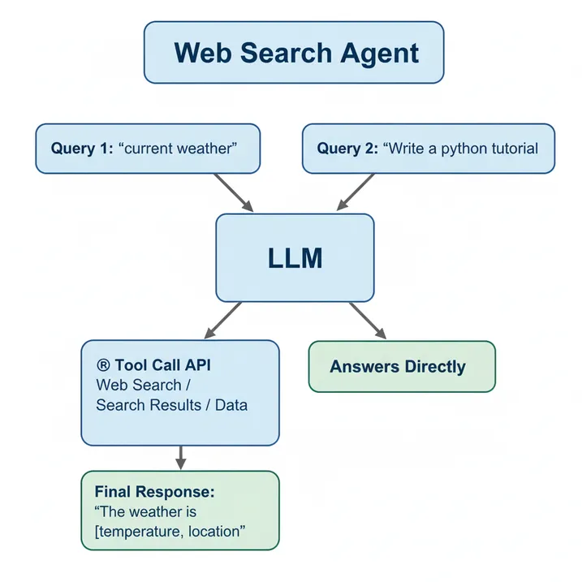

# Building A Web Search Agent using Function Calling and GPT-5

### Function Calling 
Function calling a technique for connecting a large language model (LLM) to external tools such as APIs or databases. It is used in creating AI agents to connect LLMs to tools. In function calling, each tool is defined as a code function (for example, a weather API to fetch the latest forecast) along with a JSON Schema that specifies the function’s parameters and instructs the LLM on when and how to call the function for a given task.

The type of function defined depends on the task the agent is designed to perform. For example, for a customer support agent we can define a function that can extract information from unstructured data, such as PDFs containing details about a business’s products.

In this tutorial will demonstrate how to use function calling to build a simple web search agent using GPT-5 as the large language model.

### Basic Structure of Web Search Agent

#### The main logic behind the web search agent:

* Define a code function to handle the web search.

* Define custom instructions that guide the large language model  in determining when to call the web search function based on the query. For example, if the query asks about the current weather, the web search agent will recognize the need to search the internet to get the latest weather reports. However, if the query asks it to write a tutorial about a programming language like Python, something it can answer from its pre-trained knowledge it will not call the web search function and will respond directly instead.

#### Prerequisite
[Create an OpenAI Account](https://auth.openai.com/create-account) if you don’t have one and [Generate an API Key](https://platform.openai.com/api-keys).

###### Set up and Activate Environment 

```
python3 -m venv env
source env/bin/activate
```

##### Export OpenAI API Key

```
export OPENAI_API_KEY=Your Openai API Key
```

##### Setup Tavily for Web Search 

Tavily is a specialized web-search tool for AI agents. Create an account on Tavily.com, once your profile is set up, an API key will be generated that you can copy into your environment. New account receives 1000 free credits that can be used for up to 1000 web searches. 
```
export TAVILY_API_KEY=Your Tavily API Key
```

##### Install Packages

```
pip3 install openai
pip3 install tavily-python
```

### Step by Step Building A Web Search Agent with Function Calling

##### Step1: Create Web Search Function with Tavily

A web search function is implemented using Tavily, serving as the tool for function calling in the web search agent.
``` python
from tavily import TavilyClient

tavily = TavilyClient(api_key=os.getenv("TAVILY_API_KEY"))

def web_search(query: str, num_results: int = 10):
    try:
        result = tavily.search(
            query=query,
            search_depth="basic",
            max_results=num_results,
            include_answer=False,       
            include_raw_content=False,
            include_images=False
        )

        results = result.get("results", [])

        return {
            "query": query,
            "results": results, 
            "sources": [
                {"title": r.get("title", ""), "url": r.get("url", "")}
                for r in results
            ]
        }

    except Exception as e:
        return {
            "error": f"Search error: {e}",
            "query": query,
            "results": [],
            "sources": [],
        }
```
##### Web function code break down

Tavily is initialized with its API key. In the web_search function, the following steps are performed:

* Tavily search function is called to search the internet and retrieve the top 10 results.

* The search results and their corresponding sources are returned.

* This returned output will serve as relevant context for the web search agent: which we will define later in this article, to fetch up-to-date information for queries (prompts) that require real-time data such as weather forecasts. 


#### Step2: Create Tool Schema

The tool schema defines custom instructions for an AI model on when it should call a tool, in this case the tool that will be used is a web search function. It also specifies the conditions and actions to be taken when the model calls a tool. A json tool schema is defined below based on the OpenAI tool schema structure.
```
tool_schema = [
    {
        "type": "function",
        "name": "web_search",

        "description": """Execute a web search to fetch up to date information. Synthesize a concise, 
        self-contained answer from the content of the results of the visited pages.
        Fetch pages, extract text, and provide the best available result while citing 1-3 sources (title + URL). 
        If sources conflict, surface the uncertainty and prefer the most recent evidence.
        """,

        "strict": True,
        "parameters": {
            "type": "object",
            "properties": {
                "query": {
                    "type": "string",
                    "description": "Query to be searched on the web.",
                },
            },
            "required": ["query"],
            "additionalProperties": False
        },
    },
]
```
#### Tool schema’s Properties

* type: Specifies that the type of tool is a function.

* name: the name of the function that will be used for tool call, which is web_search.

* description: Describes what the AI model should do when calling the web search tool. It instructs the model to search the internet using the web_search function to fetch up-to-date information and extract relevant details to generate the best response.

* strict: It is set to true, this property instructs the LLM to strictly follow the tool schema’s instructions.

* parameters: Defines the parameters that will be passed into the web_search function. In this case, there is only one parameter: query which represents the search term to look up on the internet. 

* required:  Instructs the LLM that query is a mandatory parameter for the web_search function. 

* additionalProperties: it is set to false, meaning that the tool’s arguments object cannot include any parameters other than those defined under parameters.properties.

### Step3: Create Web Search Agent Using GPT-5 and Function Calling

Finally I will build an agent that we can chat with, which can search the web when it needs up-to-date information. I will use GPT-5-mini, a fast and accurate model from OpenAI, along with function calling to invoke the tool schema and the web search function already defined.
``` python
from datetime import datetime, timezone
import json
from openai import OpenAI
import os 

client = OpenAI(api_key=os.getenv("OPENAI_API_KEY"))

# tracker for the last model's response id to maintain conversation's state 
prev_response_id = None

# a list for storing tool's results from the function call 
tool_results = []

while True:
    # if the tool results is empty prompt message 
    if len(tool_results) == 0:
        user_message = input("User: ")

        """ commands for exiting chat """
        if isinstance(user_message, str) and user_message.strip().lower() in {"exit", "q"}:
            print("Exiting chat. Goodbye!")
            break

    else:
        # set the user's messages to the tool results to be sent to the model 
        user_message = tool_results.copy()
    
        # clear the tool results for the next call 
        tool_results = []

    # obtain current's date to be passed into the model as an instruction to assist in decision making
    today_date = datetime.now(timezone.utc).date().isoformat()     

    response = client.responses.create(
        model = "gpt-5-mini",
        input = user_message,
        instructions=f"Current date is {today_date}.",
        tools = tool_schema,
        previous_response_id=prev_response_id,
        text = {"verbosity": "low"},
        reasoning={
            "effort": "low",
        },
        store=True,
        )
    
    prev_response_id = response.id

    # Handles model response's output 
    for output in response.output:
        
        if output.type == "reasoning":
            print("Assistant: ","Reasoning ....")

            for reasoning_summary in output.summary:
                print("Assistant: ",reasoning_summary)

        elif output.type == "message":
            for item in output.content:
                print("Assistant: ",item.text)

        # checks if the output type is a function call and append the function call's results to the tool results list
        elif output.type == "function_call":
            # obtain function name 
            function_name = globals().get(output.name)
            # loads function arguments 
            args = json.loads(output.arguments)
            function_response = function_name(**args)
            # append tool results list with the the function call's id and function's response 
            tool_results.append(
                {
                    "type": "function_call_output",
                    "call_id": output.call_id,
                    "output": json.dumps(function_response)
                }
            )
```
#### Step by Step Code Breakdown

``` python
from openai import OpenAI
import os 

client = OpenAI(api_key=os.getenv("OPENAI_API_KEY"))
prev_response_id = None
tool_results = []
```
* Initialized the OpenAI model API with an API key.

* Initialized two variables prev_response_id and tool_results. prev_response_id keeps track of the model’s response to maintain conversation state, and tool_results is a list that stores outputs returned from the web_search function call.

The chat runs inside the loop. A user enters a message and the model called with tool schema accepts the message, reasons over it,  decides whether to call the  web search tool, and then the tool’s output is passed back to the model. The model generates a context-aware response. This continues until the user exits the chat.

#### Code Walkthrough of the Loop
``` python
if len(tool_results) == 0:
    user_message = input("User: ")
    if isinstance(user_message, str) and user_message.strip().lower() in {"exit", "q"}:
        print("Exiting chat. Goodbye!")
        break

else:
    user_message = tool_results.copy()
    tool_results = []

today_date = datetime.now(timezone.utc).date().isoformat()     

response = client.responses.create(
    model = "gpt-5-mini",
    input = user_message,
    instructions=f"Current date is {today_date}.",
    tools = tool_schema,
    previous_response_id=prev_response_id,
    text = {"verbosity": "low"},
    reasoning={
        "effort": "low",
    },
    store=True,
    )

prev_response_id = response.id
```
* Checks if the tool_results is empty. If it is, the user will be prompted to type in a message, with an option to quit using exit or q.

* If the tool_results is not empty,  user_message will be set to the collected tool outputs to be sent to the model.  tool_results is cleared to avoid resending the same tool outputs on the next loop iteration.

* The current date (today_date)  is obtained to be used by the model to make time-aware decisions.

* Calls client.responses.create to generate the model’s response and it accepts the following parameters:

    model: set to gpt-5-mini.   

    input: accepts the user’s message. 

    instructions: set to current’s date (today_date).

    tools: set to the tool schema that was defined earlier. 

    previous_response_id: set to the previous response’s id so the model can maintain conversation state.

    text: verbosity is set to low to keep model’s response  concise. 

    reasoning: GPT-5-mini is a reasoning model, set the reasoning’s effort to low for faster’s response. For more complex tasks we can set it to high.

    store: tells the model to store the current’s response so it can be retrieved later and helps with conversation continuity.

* prev_response_id is set to current’s response id so the next function call can thread onto the same conversation.    

``` python
for output in response.output:
    if output.type == "reasoning":
        print("Assistant: ","Reasoning ....")

        for reasoning_summary in output.summary:
            print("Assistant: ",reasoning_summary)

    elif output.type == "message":
        for item in output.content:
            print("Assistant: ",item.text)

    elif output.type == "function_call":
        # obtain function name 
        function_name = globals().get(output.name)
        # loads function arguments 
        args = json.loads(output.arguments)
        function_response = function_name(**args)
        # append tool results list with the the function call's id and function's response 
        tool_results.append(
            {
                "type": "function_call_output",
                "call_id": output.call_id,
                "output": json.dumps(function_response)
            }
        )
```
Process the model’s response output and do the following;

* If the output type is reasoning, print each item in the reasoning summary.

* If the output type is message, iterate through the content and print each text item.

* If the output type is a function call, obtain the function’s name, parse its arguments, and pass them to the function (web_search) to generate a response. In this case, the web search response contains up-to-date information relevant to the user’s message.  Finally appends the function call’s response and function call id to  tool_results. This lets the next loop send the tool result back to the model.

When you run the code, you can easily chat with the agent to ask questions that require the latest information, such as the current weather or the latest product releases. The agent responds with up-to-date information along with the corresponding sources from the internet.

#### Below is a sample output from the terminal.

```
User: What is the weather like in London today?
Assistant:  Reasoning ....
Assistant:  Reasoning ....
Assistant:  Right now in London: overcast, about 18°C (64°F), humidity ~88%, light SW wind ~16 km/h, no precipitation reported. Source: WeatherAPI (current conditions) — https://www.weatherapi.com/

User: What is the latest iPhone model?
Assistant:  Reasoning ....
Assistant:  Reasoning ....
Assistant:  The latest iPhone models are the iPhone 17 lineup (including iPhone 17, iPhone 17 Pro, iPhone 17 Pro Max) and the new iPhone Air — announced by Apple on Sept 9, 2025. Source: Apple Newsroom — https://www.apple.com/newsroom/2025/09/apple-debuts-iphone-17/

User: Multiply 500 by 12.           
Assistant:  Reasoning ....
Assistant:  6000
User: exit   
Exiting chat. Goodbye!
```
You can see the results with their corresponding web sources. When you ask it to perform a task that doesn’t require up-to-date information, such as maths calculations or writing code the agent responds directly without any web search.

##### Note: The web search agent is a simple, single-tool agent. Advanced agentic systems orchestrate multiple specialized tools and use efficient memory to maintain context, plan, and solve more complex tasks.


This is the [notebook](Notebooks/web_search_agent.ipynb) for the full code of the Web Search Agent. 

