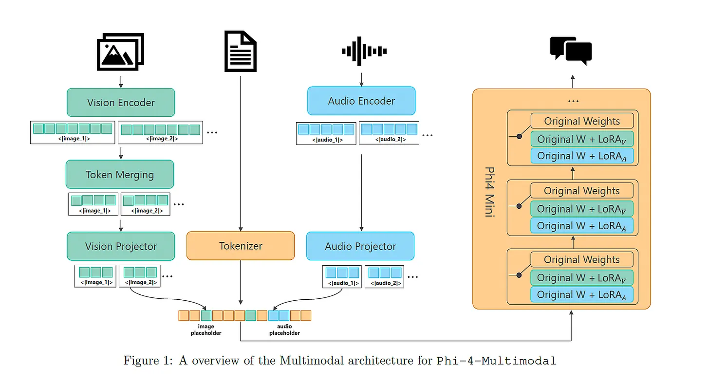

# Review of Phi-4 Multimodal

Phi-4-Multimodal is a 5.6-billion-parameter multimodal model built upon the Phi-4-Mini language model- a 3.8 billion parameters. It supports multiple modalities: text, image and audio inputs.

For vision-related tasks, Phi-4-Multimodal was trained on high-quality multimodal instruction datasets covering tasks like general image understanding, OCR (Optical Character Recognition), chart interpretation, diagram comprehension, and video summarization.

For speech/audio tasks, the model was trained on approximately 2 million hours of anonymized speech-text pairs for automatic speech recognition (ASR), and on diverse audio instruction datasets for tasks like speech summarization, speech question-answering, automatic speech translation (AST), and audio understanding.

Phi-4-Multimodal is a highly performant model achieving exceptional results on both vision and speech benchmarks. It rivals closed-source models such as Gemini and GPT-4o in various vision tasks, and it is currently ranked as the number 1 model for speech recognition on the HuggingFace OpenASR Leaderboard.

### Training Overview
The base language model, Phi-4 Mini, was frozen and new modalities (vision and audio) were incorporated into it using a technique called “Mixture of LoRAs”.

* Mixture of LoRAs : LoRA (Low-Rank Adaptation) is a method for adapting a pre-trained model to new tasks or modalities without significantly altering its original parameters. It involves inserting small, trainable low-rank matrices (adapters) into specific layers such as the linear layers within attention and feed-forward modules of the pre-trained Transformer model.

In Phi-4 Multimodal, dedicated LoRA adapters were trained specifically for vision and audio tasks. These adapters were integrated into the linear layers of the frozen Phi-4 Mini model, enabling it to process new modalities without changing the original model weights.

## Phi-4 Modalities

### Image Modality
* Dynamic Cropping Strategy: Phi-4 uses this technique to divide image into smaller crops for handling different image resolutions before it is passed into the image encoder.

* Vision(Image)Encoder: Phi-4 uses SigLIP-400M as its image encoder. This model converts cropped images into image embeddings that represent visual content and details.

* Vision Projector: A 2-layer MLP(Multilayer Perceptron) module is used by Phi-4 to adapt image embeddings from the image encoder for the language model(Phi-4 mini). It projects the extracted features from the image encoder into the embedding dimension supported by the language model.

* Vision LoRA Adapter: The vision LoRA adapter integrated with the Phi-4 model allows the language model to process adapted image embeddings from the vision projector and perform vision-language tasks, such as image captioning or visual question answering.

In summary what happens within the Image modality:
* Step 1: The image is preprocessed via dynamic cropping and passed through the image encoder.

* Step 2: The image encoder processed the cropped images and extracts visual information from them and pass them to the vision projector.

* Step 3: The vision projector then transforms the image encoder’s output into the embedding dimension supported language model(Phi-4 mini).

* Step 4: Finally, the vision LoRA adapter injects the adapted features from the vision projector into the language model’s (Phi-4 mini) processing pipeline, allowing it to generate outputs that incorporate visual context. These connected components enable Phi‑4‑Multimodal to solve image tasks like image captioning and visual question answering.

### Audio Modality
* Audio Processing: Audio input is first transformed into 80-dimensional log-Mel filter-bank features, a correct format to represent audio signals capturing the essential frequency components.

* Audio Encoder: It is consists of 3 convolution layers and 24 Conformer blocks (conformer is a specialized model for audio processing). The encoder extracts sound information from the processed audio signals.

* Audio Projector: Phi-4 uses a 2-layer MLP to project the extracted audio features from the audio encoder to the same embedding dimension supported by the language model(Phi-4 Mini)

* Audio LoRA Adapter: The audio LoRA adapter integrated with the Phi-4 model processes the adapted embeddings from the audio projector and solve tasks like automatic speech recognition (speech-to-text), audio summarization, and audio question answering.

In summary what happens within the Audio modality:
* Step 1: The audio(speech) input is preprocessed into 80-dimensional log-Mel filter-bank features for correct audio signals representation and passed into the audio encoder

* Step 2: The audio encoder extracts sound information from the the processed audio signals and passed it into the audio projector.

* Step 3: The audio projector transforms the audio encoder’s output into a text-friendly embedding dimension, aligning the audio features with the language model’s (Phi-4 mini) input format.

* Step 4: Finally, the audio LoRA adapter injects these adapted audio features into the language model’s (Phi-4 mini) processing pipeline,, allowing the language model to generate outputs that incorporate audio context. Together, these connected components enable Phi‑4‑Multimodal to seamlessly integrate speech data into its text-based generation framework and solve tasks like describing the content of an audio file.

Phi-4 multimodal can process speech(audio) in multiple languages: English, Chinese, German, French, Italian, Japanese, Spanish, Portuguese.

## Code for Running Phi-4 Multimodal
#### Install Required Packages
* requirements.txt file
```
flash_attn==2.7.4.post1
torch==2.6.0
transformers==4.48.2
accelerate==1.3.0
soundfile==0.13.1
pillow==11.1.0
scipy==1.15.2
torchvision==0.21.0
backoff==2.2.1
peft==0.13.2
```
Paste the packages above in a txt file and install using:
```
pip3 install -r requirements.txt
```

#### Load Model
``` python
from transformers import AutoModelForCausalLM, AutoProcessor,GenerationConfig

# Define model path
model_path = "microsoft/Phi-4-multimodal-instruct"

# Load model and processor
processor = AutoProcessor.from_pretrained(model_path, trust_remote_code=True)

model = AutoModelForCausalLM.from_pretrained(model_path, device_map="cuda",
    torch_dtype="auto",trust_remote_code=True,
    # if you do not use Ampere or later GPUs, change attention to "eager"
    _attn_implementation='flash_attention_2'
).cuda()

# Load generation config
generation_config = GenerationConfig.from_pretrained(model_path)

# Define prompt template
user_prompt = '<|user|>'
assistant_prompt = '<|assistant|>'
prompt_suffix = '<|end|>'
```
###### Step By Step Code Breakdown

* Loaded the Phi-4 multimodal model from Hugging Face Transformers, along with the processor for input preprocessing during inference.

* Defined the generation configuration to be used during inference.

* Created a prompt template for formatting prompts before passing them to the model.

#### Function for Running an Image
``` python
import requests
from PIL import Image
from urllib.parse import urlparse

def process_image(prompt, image_path):
    prompt = f'{user_prompt}<|image_1|>{prompt}{prompt_suffix}{assistant_prompt}'
    
    # Check if the image_path is a URL or a local file
    parsed_url = urlparse(image_path)
    is_url = bool(parsed_url.scheme and parsed_url.netloc)
    
    if is_url:
        image = Image.open(requests.get(image_path, stream=True).raw)
    else:
        image = Image.open(image_path)
    
    # Process image
    inputs = processor(text=prompt, images=image,  return_tensors='pt').to('cuda:0')

    # Generate output
    generate_ids = model.generate(
        **inputs,
        max_new_tokens=1000,
        generation_config=generation_config,
    )

    # Retrieve response from the generated output
    generate_ids = generate_ids[:, inputs['input_ids'].shape[1]:]
    response = processor.batch_decode(
        generate_ids, skip_special_tokens=True, clean_up_tokenization_spaces=False
    )[0]
    
    return response
```
###### Step By Step Code Breakdown

* The function process_image accepts a prompt and an image path. It performs the following tasks:

* Loads the image and passes both the prompt and image to the processor for preprocessing.

* The processed inputs from the processor are passed to the generate function to produce an output based on the image and prompt.

* The generated output is post-processed to extract the response, which is then returned.

##### Sample Image


```python
image_path = "https://cdn.pixabay.com/photo/2015/11/29/13/08/kingfisher-1068684_1280.jpg"
prompt = "What is shown in this image?"
process_image(prompt, image_path)
```
##### Generated Response

```
The image depicts a kingfisher in mid-flight, with its wings spread wide 
as it dives towards the water. The bird is captured in a moment of action, 
with water droplets visible around it, indicating the speed of its descent. 
The background is blurred, focusing the viewer's attention on the bird and 
the splashing water.
```

##### Sample Image2


``` python
image_path = "https://cdn.pixabay.com/photo/2016/11/29/04/54/photographer-1867417_1280.jpg"
prompt = "Describe this image."
process_image(prompt, image_path)
```

#### Generated Response

```
The image shows a person with a blurred face, wearing a black jacket 
and a watch, holding a Sony camera with a lens cap on. 
The background features a body of water and a hilly landscape.
```

The model was able to generate accurate responses describing the images.

#### Function for Running on Audio
``` python
import soundfile as sf
import io
from urllib.request import urlopen

def process_audio(prompt, audio_path):
    prompt = f'{user_prompt}<|audio_1|>{prompt}{prompt_suffix}{assistant_prompt}'
    # Download and open audio file
    audio, samplerate = sf.read(io.BytesIO(urlopen(audio_path).read()))
    
    # Process with the audio
    inputs = processor(text=prompt, audios=[(audio, samplerate)], return_tensors='pt').to('cuda:0')

    # Generate response
    generate_ids = model.generate(
        **inputs,
        max_new_tokens=1000,
        generation_config=generation_config,
    )
    generate_ids = generate_ids[:, inputs['input_ids'].shape[1]:]
    response = processor.batch_decode(
        generate_ids, skip_special_tokens=True, clean_up_tokenization_spaces=False
    )[0]

    return response
```
###### Step By Step Code Breakdown

The function process_audio accepts a prompt and an audio path. It performs a similar task to the image processing function. It does the following:

* Loads the audio file and passes both the prompt and audio to the processor for preprocessing.

* The processed inputs from the processor are passed to the generate function to produce an output based on the audio and prompt.

* The generated output is post-processed to extract the response, which is then returned.

``` python
audio_prompt = """Transcribe the audio to text"""
audio_url = "https://upload.wikimedia.org/wikipedia/commons/b/b0/Barbara_Sahakian_BBC_Radio4_The_Life_Scientific_29_May_2012_b01j5j24.flac"
print(process_audio(audio_prompt, audio_url))
```

##### Generated Response from Audio

```
what we do as a society we have to think about where we're moving to i frequently talk to students 
about cognitive enhancing drugs and a lot of students take them for 
studying and exams but other students feel angry about this they feel 
those students are cheating and we have no long-term health and safety 
studies in healthy people and we really need those 
before people start taking them. 
```

#### References
[Phi-4-Mini Technical Report: Compact yet Powerful Multimodal Language Models via Mixture-of-LoRAs](https://arxiv.org/abs/2503.01743)
