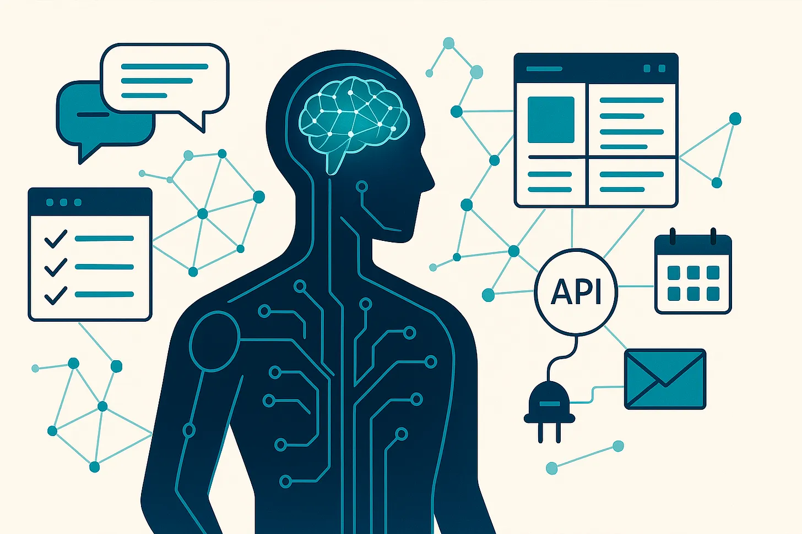

AI Agent and Large Language Model (LLM)

Large Large Model is an advanced AI model built on deep neural networks like transformers and has been trained on vast amount of text to generate human-like text. LLMs like ChatGPT, Claude, Gemini, Grok are capable of solving a lot of challenging problems and are used in different fields such as science, health, eduction, finance to tackle challenging problems. AI agent  is used to extend the functionalities of LLMs to solve tasks that are beyond their pre-trained knowledge.  An LLM can easily solve a task like write a tutorial on Python using its pretrained knowledge, but when you asked to do something like book a flight for me. This is beyond its pre-trained knowledge and it needs to be able to access your calendar and do web search to book a flight for you. This is where agent comes in it is used to connect an LLM to an external tool to perform actions. Some of the common actions include:

Weather forecast, the LLM will be connected with web search to fetch latest weather forecast.

Using a booking agent an AI agent that can check the user’s calendar, do web search visit a booking site like Expedia search available options for flight and hotel booking, get back to the user with available options for confirmation and book the flight. 

How an AI Agent Works

AI agent is a system that uses a Large Language Model to plan, reason and take steps to interact with its environment using tools suggested from the model’s reasoning to solve a particular task.

Basic Structure of an AI Agent

Large Language Model(LLM)

LLM is the brain of the AI agent that takes in a prompt from the user, plan and reason through the request and break down problem into steps that will determine the tools it will interact with to fulfil its tasks.

                                         TOOL

Tool is the framework that the agent uses to perform an action based on the steps and reasoning from the Large Language Model.  If you ask an LLM to book a table for you at a restaurant, possible tools that will be used include access to calendar to check your availability and a web search tool to access the restaurant website and book a table for you.   

Illustrated Decision Making of a Booking AI Agent

AI agents can have access to different tools depending on the type of task. The tool can be a data store like a database such as a customer support agent that have access to customer’s account details, purchase history from which it can decide to extract information from whenever it want to assist a customer on a problem. 

AI agents are used in solving  a lot of tasking and there are so many great agents out there. Coding agents particularly Agentic IDEs like cursor, windsurf, Copilot  have helped engineers code, debug faster and build projects quicker.  Claude Code, Codex CLI can interact with a user’s desktop and terminals and carry out coding tasks.  ChatGPT has agent support and can perform tasks like booking a reservation on behalf of a user. Agents are also integrated into customer supports to communicate with consumers and solve their issues. 

Working Mechanism of an AI Agent (Thought Act Observation)

The decision making process of an AI Agent follows an approach known as Thought Act Observation.  

Thought: Large Language Model reasons and plans on what actions or steps to be taken based on the prompt such as the tools to be used. 

Act: The agent performs an action(uses a tool) based on the reasoning of the Large Language Model.

Observation: The LLM observes the result of the action taken.

The Thought Act Observation is a cycle of the LLM thinking of what do deciding the action/tool to be used by agent, the agent using the tool and taking the necessary action, LLM observes the output of the action if it is success or failure, think again and the agent takes the next action. Thought Act Observation is a repeated cycle that keeps going till a problem is solved.  It is analogous to a human thinking process when we are given a problem, we first think about how to solve the problem, take action on our thoughts we observe and observe the results of the action if it solves the problem, making necessary adjustments based on the results of our actions.  The steps taken during Thought Act Observation cycle depends on the complexity of the work at hand, the more complex, the more the steps. For better understanding of the Thought Act Observation Cycle we shall use a customer support agent that is built to solve user’s billing issues. 

Problem: A customer opened a ticket saying, ‘I was billed twice for my subscription.

There are 9 steps taken by the Billing agent to resolve the user’s billing issues. The breakdown of the details of the tabular diagram below;

Step 1–3: Thought: Let me check the user’s billing history and account details to understand the problem.Action: Checks the user’s account details and billing details.Observation: Observed the user was billed twice.

Step 4–6: Thought: The next step is to issue a refund for the additional billing.Action: Sets up a refund for the extra amount billed.Observation: Refund setup successful; no issues.

Step 7–9: Thought: Let me confirm the refund with the user.Action: Sends confirmation to the user about the successful refund.Observation: Confirmation successfully delivered to the user.

In the next section I will show how to build a simple AI agent that con web search using Function Calling and Open AI API with GPT-5. 